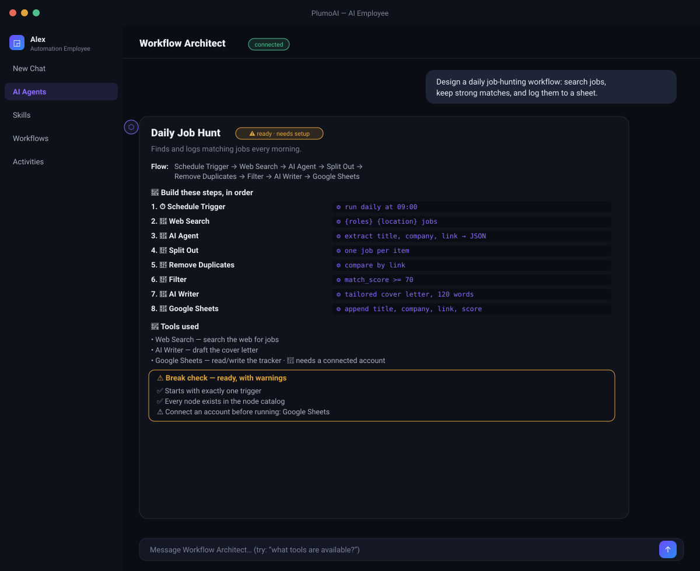

# Workflow Architect

Designs a complete PlumoAI workflow from a plain-language spec. You describe the
goal, the inputs you will provide, and the outputs you want; it returns an
ordered, node-by-node build plan — grounded on the tools actually installed in
your setup, with a break-checker that flags anything that would stop the
workflow running.

> _Illustration — example of the agent's chat output. Not a captured screenshot._

## What it does

- **Grounded on real tools** — the design uses only the built-in nodes and the
  AI Agent plugins actually installed (each chosen by what it is for), so it
  never suggests a tool that does not exist.
- **Break-checker** — every plan is verdicted `ready` / `needs setup` /
  `will not run`, flagging a missing trigger, an unknown node, a dangling
  branch, and which tools need a connected account.
- **Tools reference** — ask *"what tools are available?"* or *"which tool for
  sending email?"* and it returns the grouped catalog (🔑 marks tools that need
  an account), answered without an LLM call.

## Output

The agent returns the plan as chat markdown: a status badge, a one-line **Flow**,
the numbered **build steps** with each node's config, a **Tools used** list, and
the **Break check** result.

It produces the design/plan — it does not draw the workflow on the canvas
automatically (that needs the platform's internal workflow API).

## Files

| File | Purpose |
|---|---|
| `plugin.json` | Plugin manifest (`type: python_tool_agent`) |
| `entrypoint.py` | `create_tool_agent(...)` the platform calls |
| `workflow_architect_agent_tool.py` | The agent: tool catalog, design, validation, break-checker, tools reference |
| `test_workflow_architect.py` | Self-contained tests — `python3 test_workflow_architect.py` (no pytest needed) |
| `workflow_architect.svg` | Menu icon |
| `preview.svg` | The illustration above |
